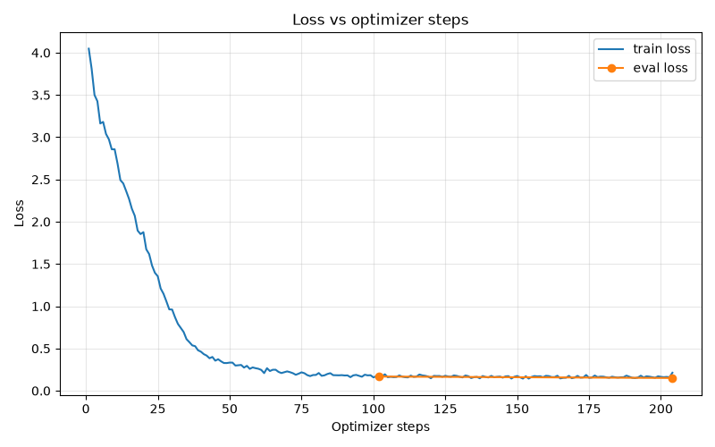

Why Fine Tuning ?

- Make the model learn the output structure, small llms were expereincing hallucination (wrapped in arrays, incomplete item object) leading failed validation and breaking the rest of the app logic 
- Just training one target_modules=["q_proj"], did not help, the model was able to adapt the response structure but on what to populate based on what prompt, that was incorrect (it was populating half way but incorrectly)

- Training all 3 attention modules - led to better results, 20-30% improvement

- Training the base model with all attention layers

r = 16/ aplha = 64
============================================================
  TEST SCORE
============================================================
  Single-turn: 183/243 (75.3%)
  Multi-turn:  61/99 (61.6%)
  OVERALL:     244/342 (71.3%)
============================================================

3e-4 learning rate

============================================================
  TEST SCORE
============================================================
  Single-turn: 214/243 (88.1%)
  Multi-turn:  78/99 (78.8%)
  OVERALL:     292/342 (85.4%)
============================================================

8/32

============================================================
  TEST SCORE
============================================================
  Single-turn: 151/243 (62.1%)
  Multi-turn:  41/99 (41.4%)
  OVERALL:     192/342 (56.1%)
============================================================

- 
